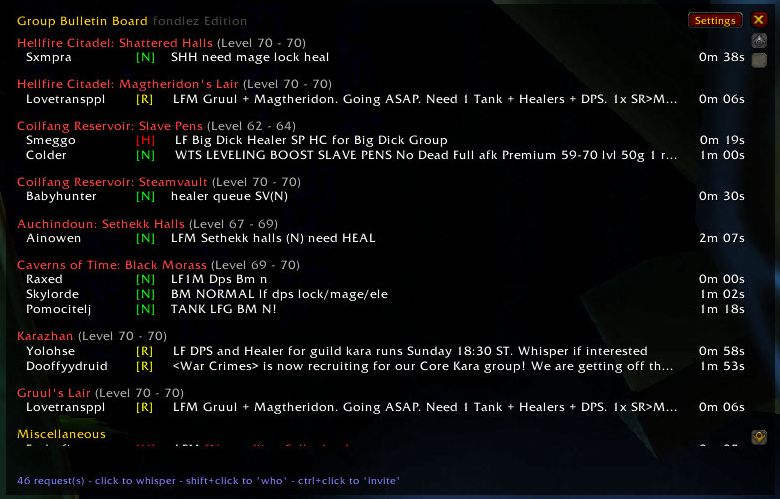
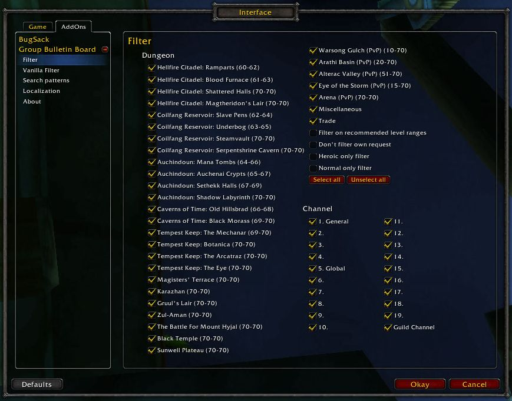

# GroupBulletinBoard – Epoch Edition

### [Download Latest](https://github.com/GroupBulletinBoard-Epoch/GroupBulletinBoard-Epoch/releases/latest) *COMING SOON*

This is a fork of the original GroupBulletinBoard addon—originally built as a Classic/TBC solution—now customized for the EpochWoW private server. This version supports Epoch’s custom dungeons.

## Based on

- Port contributions by [fondlez](https://github.com/fondlez/GroupBulletinBoard)
- TBC 2.4.3 backport: [Obszczymucha aka. Ohhaimark](https://codeberg.org/obszczymucha/group-bulletin-board-tbc)
- Classic TBC addon: [Vyscî-Whitemane](https://github.com/Vysci/LFG-Bulletin-Board)
- Original addon: https://legacy.curseforge.com/wow/addons/group-bulletin-board

## Description

GroupBulletinBoard (GBB) provides an overview of group formation requests posted in chat channels. It detects instance requests, sorts them, and presents them in a clear, organized interface. With a variety of filtering options, you can focus on the custom dungeons available on EpochWoW. Additionally, GBB notifies you of new requests via sound or chat alerts.

## Graphical Interface

### Main Window

### Interface Settings

## Slash Commands
To open the settings, use slash command: **`/gbb`** or click the minimap icon.

`<value>` can be true, 1, enable, false, 0, disable. If <value> is omitted, the 
current status switches.

* `/gbb notify chat <value>` - On new request make a chat notification
* `/gbb notify sound <value>` - On new request make a sound notification
* `/gbb debug <value>` - Show debug information
* `/gbb reset` -  Reset main window position
* `/gbb config/setup/options` - Open configuration
* `/gbb about` - open about
* `/gbb help` - Print help
* `/gbb chat clean/organize` - Creates a new chat tab if one doesn't already 
exist, named \"LFG\" with all channels subscribed. Removes LFG heavy spam 
channels from default chat tab
* `/gbb` - open main window

## Maintainer

This fork is maintained by **dmt** on EpochWoW.

## Credits

**Original Addon Credits:**
  - Arrogant_Dreamer, Hubbotu, and kavarus for the Russian translation. (now removed)
  - Baudzilla for the graphics and inspiration behind the resize-code.

**Port Contributions:** 
  - fondlez

## Support

Please contact me in-game ("dmt") or on EpochWow's Discord #addons

## TODO

GBB interface
- [ ] clean up language/boxes

Filter
- [ ] migrate "vanilla filter" to "filter"
- [ ] remove "vanilla filter"
- [ ] remove heroics, reduce level cap to 60
- [ ] add custom epoch content (Gillijim's Isle =GIL, Tol Barad=TB, Glittermurk Mines=?) 
- [ ] autocheck filter cleanup

Search Patterns
- [ ] fix capitalization/language
- [ ] format search patterns (clean up)
- [ ] add clarification for sm, dm, vc ordering (move up?)
- [ ] remove foreign language support (minus localization)

About
- [x] credits

Misc
- [ ] fix right-click on minimap icon only working on first click
- [x] update readme text
- [ ] update readme screenshots

